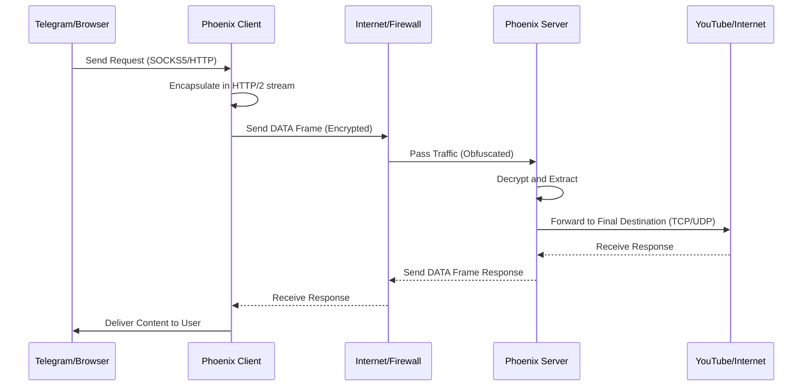

# Architecture & Security

::: info Technical Level: Advanced
This page is designed for professional users and developers who want to understand the intricate operational details, protocols, and security mechanisms of Phoenix.
:::

## 1. Architectural Overview

Phoenix is an anti-censorship tool that hides network traffic within the standard **HTTP/2 (h2)** protocol. The primary goal is to deceive Deep Packet Inspection (DPI) systems into identifying your traffic as "normal web browsing."



### Core Components

#### A. Transport Layer - HTTP/2

We use the standard Go library (`net/http`) and the `golang.org/x/net/http2` package to establish stable connections. Unlike many tools that use incomplete or custom HTTP/2 implementations, Phoenix has the exact fingerprint of standard Go clients.

- **Multiplexing:** All data streams (e.g., thousands of separate TCP requests) are Encapsulated within a single TCP connection. Each stream is identified by a unique Stream ID. This technique reduces the RTT (Round Trip Time) for new requests to zero.
- **Header Compression (HPACK):** Using the HPACK compression algorithm, redundant HTTP headers are removed. Aside from reducing bandwidth consumption, this makes it very difficult for DPI to analyze traffic patterns based on header sizes.
- **Flow Control:** The HTTP/2 flow control mechanism (both at the connection and stream levels) automatically adjusts the data transmission rate to prevent network congestion.

#### B. Security Layer - TLS 1.3

All communications (except in Cleartext mode) are secured using **TLS 1.3**.

- **Handshake:** Exclusive use of TLS 1.3 ensures the entire key exchange and authentication process is encrypted, leaving only the SNI (Domain Name) in Cleartext (which will be resolvable with ECH in the future).
- **Cipher Suites:** Priority is given to `TLS_CHACHA20_POLY1305_SHA256`, which performs better on mobile processors (ARM) than AES-GCM and is more resistant to Side-channel attacks.

---

## 2. Threat Model

We have designed our security based on the following assumptions:

1.  **Client:** The user's device is assumed to be in a Trusted environment.
2.  **Server:** The Phoenix server is secure and under the full control of the user.
3.  **Network (Path):** The network between the client and the server is completely Untrusted.
    - **Passive DPI:** Passive eavesdropping on traffic to analyze patterns, timing, and packet sizes.
    - **Active Probing:** Active attempts by the censor to connect to the server and discover the protocol (Replay Attack or port scanning).
    - **MITM:** Attempts to replace the server certificate with a forged one.

---

## 3. Detailed Analysis of Security Modes

### A. mTLS Mode (Mutual Authentication) - Maximum Security

This configuration is designed to combat **Active Probing**.

- **Authentication:** During the TLS Handshake, the server requests a `Client Certificate`. The client must provide its certificate (containing the Ed25519 public key).
- **Authorization:** The server compares the hash of the client's public key against the `authorized_clients` list in its config file.
- **Behavior on Error:** If the client provides an invalid certificate or none at all, the server drops the connection during the Handshake phase (`bad_certificate`). This means a firewall or scanner cannot even reach the HTTP/2 layer.

### B. One-Way TLS Mode (Like HTTPS) - Standard Security

In this mode, authentication is only one-way (server to client).

- **Server Authentication:** The client uses the **Certificate Pinning** mechanism to verify the server's identity. Instead of relying on public CAs (which can be forged by state actors), we pin the hash of the server's public key directly in the client. This reduces the possibility of any MITM attack to zero.
- **Client Anonymity:** The client provides no identity. The server accepts any valid TLS connection.

### C. h2c Mode (Cleartext) - Pure Obfuscation

The HTTP/2 Cleartext (h2c) protocol runs without the TLS encryption layer.

- **Tunneled Transport:** The goal of this mode is to use higher-layer encryption (such as a CDN Edge).
- **CDN Compatibility:** Since most CDNs (Cloudflare, Gcore) can manage communication with the Origin server via HTTP (without SSL) or with Self-signed certificates, this mode is ideal for completely hiding the server's IP behind a CDN.

---

## 4. Active Defense Mechanisms

To maintain connection stability on networks experiencing "intentional disruption", Phoenix utilizes the following techniques:

### Connection Cycling & Hard Reset

Many filtering systems disrupt the TCP connection (Packet Drop) after a while (e.g., 60 seconds) or after a certain volume of data.

- **Detection:** The client continuously monitors Transport layer errors (like Timeouts or unexpected EOFs).
- **Reaction:** As soon as instability is detected (3 errors in a short period), the client performs a **Hard Reset**.
- **Reconstruction:** The entire connection pool (`ClientConn` in Go) is closed, TCP sockets are shut down, and a new Handshake is initiated. This potentially alters the routing path or source port, bypassing the disruption.

### Ed25519 Cryptography

We use **Ed25519** for all signature and key generation operations (Curve25519 for TLS key exchange).

- **Performance:** Extremely short public keys (32 bytes) and ultra-fast signature operations.
- **Security:** Security equivalent to RSA-3072 but with much higher speeds and without the Padding vulnerabilities that exist in RSA.

---

## 5. Security Best Practices

1.  **Use mTLS:** If you have a private server, always use mTLS so your server remains "invisible" to internet scanners.
2.  **Key Rotation:** Even though our cryptography is strong, standardizing on a compromised server private key could jeopardize security. It is recommended to change keys every 3 months.
3.  **Combine with CDN:** To prevent the server IP from being identified, using h2c or One-Way TLS behind a reputable CDN is recommended.

---

## 6. TLS Fingerprint Spoofing

### The Problem: Standard Go TLS Fingerprint

Every TLS client (browser, curl, Go, Python) sends a "Hello" message (`ClientHello`) when establishing a connection. The content of this message — including the list of cipher suites, extensions, and their order — acts like a unique fingerprint.

Advanced DPI systems can:

- Determine that this traffic is from a Go application (not Chrome or Firefox)
- **Block** "non-browser" traffic

```
ClientHello from Go (Recognized by DPI)
vs
ClientHello from Chrome (Mimicked by Phoenix)
```

### The Solution: The `utls` Library

Phoenix uses the [`github.com/refraction-networking/utls`](https://github.com/refraction-networking/utls) library to forge the `ClientHello` to look **exactly like real web browsers**.

```
┌─────────────────────────────────────────┐
│         Phoenix Client (Go stdlib)       │
│                   ↓                     │
│        utls.UClient (fingerprint)        │
│                   ↓                     │
│   Chrome 120 ClientHello (Spoofed)     │
│                   ↓                     │
│         Internet (DPI bypass)            │
└─────────────────────────────────────────┘
```

### How it Works

1. The client establishes a normal TCP connection.
2. `utls.UClient` starts with `HelloID = HelloChrome_Auto`.
3. The `ClientHello` message is constructed **exactly** like Chrome 120 (same cipher suites, same extensions, same order).
4. The server performs a normal TLS handshake.
5. From the DPI's perspective, there is no difference between this traffic and real Chrome traffic.

### Important Limitation: Ed25519 and Chrome

In its `ClientHello`, Chrome sends a list of `SignatureAlgorithms` — algorithms it accepts for the server's certificate. Chrome **does NOT support Ed25519** for server certificates.

**Result:** If the server uses an Ed25519 key for TLS and the client has a Chrome fingerprint, the handshake will fail.

**Phoenix Solution:** When fingerprint is enabled, the server must use an **ECDSA P256** (or RSA) key for the TLS certificate.

::: info Technical Note
The Ed25519 key is still used for **mTLS authentication** (the key pinning feature). These are two independent layers. The TLS Certificate itself can be ECDSA, while the internal application authentication still relies on Ed25519.
:::
