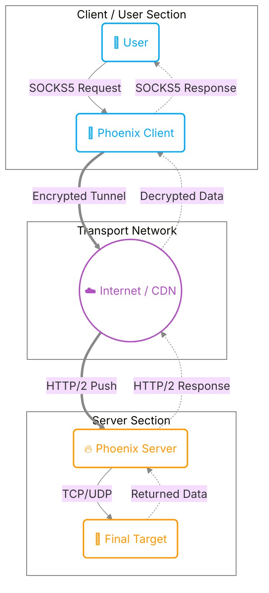

# Introduction & Getting Started (Phoenix)

Welcome to the Phoenix documentation.
Here you will learn about the basic concepts, architecture, and security modes of Phoenix so you can choose the best configuration for your needs.

## What is Phoenix?

Phoenix is a specialized tool for bypassing advanced filtering and Deep Packet Inspection (DPI) systems. Unlike traditional VPNs, Phoenix hides your traffic within standard **HTTP/2** protocols.

### Why HTTP/2?

The HTTP/2 protocol is the same language your browser uses to open websites like Google and Instagram. By using this protocol:

1. Your traffic looks exactly like normal web browsing traffic.
2. It uses **Multiplexing** to send multiple requests simultaneously (Telegram, YouTube, web browsing) over a **single** TCP connection, vastly increasing speed.
3. **Header Compression (HPACK):** Reduces the overhead of control messages by up to 99%.
4. **Flow Control:** Enables fair distribution of bandwidth among streams.
5. **TLS Fingerprint Spoofing:** Can fake a browser's TLS fingerprint to bypass DPIs that block non-browser traffic.

---

## Security Modes

::: tip Summary for Users
In this section, security modes are explained simply and without technical complexities. If you are interested in deeper technical details, please refer to the **[Architecture & Security](architecture.md)** page.
:::

Phoenix supports different security levels.
**We strongly recommend using mTLS mode, or at least One-Way TLS.**

::: info Important Note on Speed
There is no speed difference between these security modes. All modes (even mTLS with its very high security) are designed for maximum performance and speed, and you won't feel any additional overhead.
:::

::: tip CDN Compatibility
All modes below (mTLS, One-Way TLS, Insecure TLS, and Cleartext) can be used behind CDN services (like Cloudflare, Gcore, etc.).
:::

### 1. mTLS Mode (Mutual Authentication) - 🛡️ Recommended

- **Security:** Very High
- **Key Features:**
  - Completely prevents Man-in-the-Middle (MITM) attacks and eavesdropping.
  - Ensures that only clients explicitly authorized on the server can connect.
  - Prevents connections from other clients even if they possess the server's Public Key (but lack a valid authorized private key).

### 2. One-Way TLS Mode (Like HTTPS) - 🔒

- **Security:** Medium
- **Key Features:**
  - No need to define each individual client on the server (makes it easy to share configs with many users).
  - Protects the server from connections by other clients that merely know the server's address (the server simply won't respond to invalid connections).

### 3. Cleartext / h2c Mode - ⚠️

- **Security:** None
- **Key Features:**
  - By using this security mode, you prove to everyone that you are insane enough to walk like baby chicks into the arms of hungry cats in this scary world.

### 4. Insecure TLS Mode - 🔓

- **Security:** Medium (TLS without CA verification)
- **Key Features:**
  - Encrypted connection using TLS, without the need for the server's public key.
  - Best for direct connections to a server using a self-signed certificate (without a CDN).
  - Can be combined with **TLS Fingerprint** to bypass ISP DPIs.

---

## General Architecture

In the next step, you will see the step-by-step guide for **[Installation](installation.md)**.
